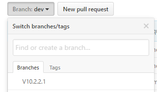

Esri welcomes contributions from anyone and everyone. Please see our [guidelines for contributing](https://github.com/esri/contributing).

## How you can contribute code to this repository

### Make a new branch in the repo
Start contributing to the *solutions-geoprocessing-toolbox* repo by making a branch. Make a new branch from **dev** on github.com: 

Select the **dev** drop down
Type a new branch name. The convention uses your initials and a title separated by dashes "-". For example: *xy-new-suitabilty-tool*

*Fetch* and *merge* the new branch from the **Esri** remote: [Getting Changes from the repo](#getting-changes-from-the-repo).

Then checkout your new branch:

`git checkout <new_branch>`

### Getting Changes from the repo
The solutions-geoprocessing-toolbox repo changes without notice, so make sure you are getting the latest updates often.

Using git command line check your *remote*:

`> git remote -v`

This command should return a list of remotes including:

`Esri	https://github.com/Esri/solutions-geoprocessing-toolbox.git (fetch)`
`Esri	https://github.com/Esri/solutions-geoprocessing-toolbox.git (push)`

Then *fetch* the changes from the Esri remote:

`> git fetch Esri`

And *merge* the changes into the target branch: 

`> git merge Esri/<target branch>`

This will get your new branch from the repo.

### Make some code

The following guides are *strongly* suggested and encouraged:
* [Python PEP8 - Style Guide for Python](https://www.python.org/dev/peps/pep-0008/)
* [Google Python Style Guide](https://google.github.io/styleguide/pyguide.html)
* [Truthful Technology's Python Style Guide](https://github.com/TruthfulTechnology/style-guide/blob/master/python.rst)
* [Python PEP257 - docstrings](https://www.python.org/dev/peps/pep-0257/)

And of course [PEP20 - The Zen of Python](https://www.python.org/dev/peps/pep-0020/)

### Share Your Mods
If you've made changes to the repo that you want to share with the community.

* Commit your changes
* Sync local with your remote
* Make a **Pull Request** from your remote fork on github.com 

### Notes On Contributing
* Always work in the **dev** branch, never in *master*. This helps us keep our releases clean.
* Never merge Pull Requests. The [Repository Owner](#repository-owner) needs to test any updates to make sure the repo is stable.
* Always log an [Issue](https://github.com/Esri/solutions-geoprocessing-toolbox/issues) for problems you find, though you should check through the existing issues to make sure it wasn't already logged. 

