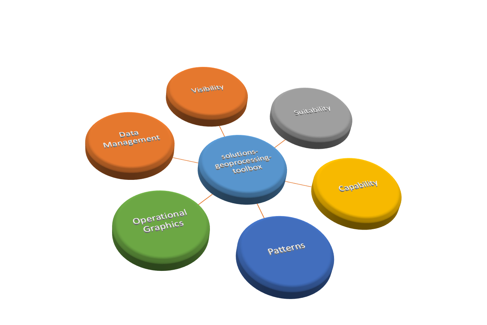

# solutions-geoprocessing-toolbox

The ArcGIS Solutions Geoprocessing Toolbox is a set of models, scripts, and tools for use in ArcGIS Desktop. These tools provide specialized processing, workflows, and analysis for defense, intelligence, emergency management, and other solutions domains.

## Sections

* [Features](#features)
* [Requirements](#requirements)
* [Instructions](#instructions)
* [Resources](#resources)
* [Issues](#issues)
* [Contributing](#contributing)
* [Licensing](#licensing)

## Features

* Specialized geoprocessing models and tools for general defense and intelligence analysis tasks including
  * Tools for visibility and range analysis
  * Tools for analyzing the battlefield environment
  * Tools for position analysis

* The [**capability**](./capability/README.md) folder contains:
  * Helicopter Landing Zone Tools
  * Point Of Origin Tools
  * ERG (Emergency Resources Guide) Tools
  
* The [**data_management**](./data_management/README.md) folder contains:
  * Adjust Sample Data Dates Tools
  * Coordinate and Conversion Tools (formerly Position Analysis Tools)
  * Publishable Task Tools
  * Build Elevation Mosaic Tools
  * Geonames Tools
  * Imagery Basemap Tools
  * Network Data Preparation Tools
  * Scanned Map Basemap Tools
  * Topographic Basemap Tools
  * Patrol Data Capture Tools
  
* The [**operational_graphics**](./operational_graphics/README.md) folder contains:
  * Clearing Operations Tools
  * Range Card Tools
  
* The [**patterns**](./patterns/README.md) folder contains:
  * Incident Analysis Tools
  * Landsat Tools
  * Change Detection Tools
  
* The [**suitability**](./suitability/README.md) folder contains:
  * Military Aspects of Terrain Tools
  * Maritime Decision Aid Tools
  * Path Slope Tools

* The [**visibility**](./visibility/README.md) folder contains:
  * Sun Position Analysis Tools
  * Visibility and Range Tools
  * Visibility Data Prep Tools

## Requirements

* ArcGIS Desktop 10.2.2 or later Standard 
* Apache Ant - used to download and extract dependent data and run test drivers
* Java Runtime Environment (JRE) or Developer Kit (JDK) (required by Ant)
* Some tools require additional licenses (these tools will be disabled if license is unavailable), see READMEs for more information: 
    * ArcGIS Desktop Advanced (ArcInfo)
    * ArcGIS Spatial Analyst Extension
    * ArcGIS 3D Analyst Extension
    * ArcGIS Network Analyst Extension
    * For example these tools require Desktop Advanced and Spatial Analyst:
        * Path Slope Tools.tbx\Path Slope
        * Visibility and Range Tools.tbx\Range Fan

## Instructions

### General Help
[New to Github? Get started here.](http://htmlpreview.github.com/?https://github.com/Esri/esri.github.com/blob/master/help/esri-getting-to-know-github.html)

### Getting Started with the tools

* Download the Github repository
    * If repository was downloaded as a zip, extract the zip file
    * Make note of this directory, the steps below assume it will be called "solutions-geoprocessing-toolbox"

### Downloading Data Dependencies/Test Data

* Install and configure Apache Ant
    * Download Ant from the [Apache Ant Project](http://ant.apache.org/bindownload.cgi) and unzip to a location on your machine, for example 'c:\apache-ant-1.9.2'.
    * Set environment variable `ANT_HOME` to Ant Install Location (e.g. the folder from first step)
    * Add Ant\bin to your path: `%ANT_HOME%\bin`
    * NOTE: Ant requires Java [Runtime Environment (JRE) or Developer Kit (JDK)](http://www.oracle.com/technetwork/java/javase/downloads/index.html) to be installed and the environment variable `JAVA_HOME` to be set to this location
    * To verify your Ant Installation: Open Command Prompt> `ant -h` and verify it runs and returns the help options correctly 
    * You may optionally install the [PyDev Eclipse Plugin for Python](http://pydev.org) if you plan to use Eclipse to run/debug
* To download the data dependencies 
    * Open Command Prompt>
    * `cd solutions-geoprocessing-toolbox`
    * `> ant`
    * Verify “Build Succeeded”  

### Running Verification Tests

* Configure and verify Ant as described in the previous steps
* To run all unit tests
    * `> cd solutions-geoprocessing-toolbox`
    * `>  ant -f run_all_tests.xml`
    *  Note/Warning: this will run the test drivers from each test directory and can take several hours to run
* To run individual unit tests
    * Open Command Prompt>
    * Go to the folder for the area you would like to test, the example below uses the `environment` area/folder, but each area has similar tests 
    * `> cd solutions-geoprocessing-toolbox\environment\test`
    * `> ant`
    * Verify “Build Succeeded”

## Resources

* Learn more about Esri's [ArcGIS for Defense maps and apps](http://resources.arcgis.com/en/communities/defense-and-intelligence/).

## Issues

* Find a bug or want to request a new feature?  Please let us know by submitting an issue.

## Contributing

Esri welcomes contributions from anyone and everyone. Please see our [guidelines for contributing](https://github.com/esri/contributing).

## Licensing

Copyright 2014 Esri

Licensed under the Apache License, Version 2.0 (the "License");
you may not use this file except in compliance with the License.
You may obtain a copy of the License at

   http://www.apache.org/licenses/LICENSE-2.0

Unless required by applicable law or agreed to in writing, software
distributed under the License is distributed on an "AS IS" BASIS,
WITHOUT WARRANTIES OR CONDITIONS OF ANY KIND, either express or implied.
See the License for the specific language governing permissions and
limitations under the License.

A copy of the license is available in the repository's
[license.txt](license.txt) file.

