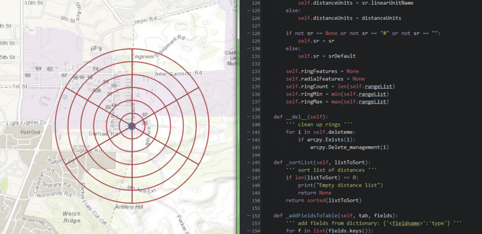

# solutions-geoprocessing-toolbox

The ArcGIS Solutions Geoprocessing Toolbox is a collection of models, scripts, and tools for use in [ArcGIS for Desktop](http://www.esri.com/software/arcgis/arcgis-for-desktop) and [ArcGIS Pro](http://www.esri.com/en/software/arcgis-pro). These tools provide specialized processing, workflows, and analysis for defense, intelligence, emergency management, and other solutions domains. With these tools you can determine visibility from a specific viewpoint, create search grids, and analyze event data. They are included with many of Esri's [Solutions Templates](http://solutions.arcgis.com/), but developers can use this repository to download and contribute to the tool development process.

### Repository Owner: [Matt](https://github.com/mfunk)

* Merge Pull Requests
* Creates Releases and Tags
* Manages Milestones
* Manages and Assigns Issues

### Secondary: [Chris](https://github.com/csmoore)

* Backup when the Owner is away

Additional information is available in the repository's [Wiki](https://github.com/Esri/solutions-geoprocessing-toolbox/wiki).

## Sections

* [Features](#features)
* [Requirements](#requirements)
* [A Tale of Two Toolboxes](#a-tale-of-two-toolboxes)
* [Instructions To Get Started](#instructions-to-get-started)
	* [General Help](#general-help)
	* [Getting Started with the tools](#getting-started-with-the-tools)
	* [Downloading Test Data](#downloading-test-data)
	* [Running Verification Tests](#running-verification-tests)
* [Mature Support](#mature-support)
* [Resources](#resources)
* [Issues](#issues)
* [Contributing](#contributing)
* [Credits](#credits)
* [Licensing](#licensing)

## Features

Specialized geoprocessing models and tools for general defense and intelligence analysis tasks including:
 
* The [**capability**](./capability/README.md) folder contains:
  * ERG (Emergency Resources Guide) Tools
  * Helicopter Landing Zone Tools
  * Point Of Origin Tools -- [This tool is moving to Mature Support](#mature-support)

* The [**data_management**](./data_management/README.md) folder contains:
  * Adjust Sample Data Dates Tools
  * CADRG ECRG Tools -- [This tool is moving to Mature Support](#mature-support)
  * CIB Tools -- [This tool is moving to Mature Support](#mature-support)
  * Elevation Tools -- [This tool is moving to Mature Support](#mature-support)
  * Geonames Tools
  * Import and Conversion Tools - formerly Position Analysis Tools -- [This tool is moving to Mature Support](#mature-support)
  * LiDAR Elevation Tools
  * Network Data Preparation Tools -- [This tool is moving to Mature Support](#mature-support)
  * Patrol Data Capture Tools -- [This tool is moving to Mature Support](#mature-support)
  * Publishable Task Tools -- [This tool is moving to Mature Support](#mature-support)

* The [**operational_graphics**](./operational_graphics/README.md) folder contains:
  * Clearing Operations Tools
  * Range Card Tools -- [This tool is moving to Mature Support](#mature-support)
  
* The [**patterns**](./patterns/README.md) folder contains:
  * Incident Analysis Tools
  * Movement Analysis Tools

* The [**suitability**](./suitability/README.md) folder contains:
  * Maritime Decision Aid Tools
  * Military Aspects of Terrain Tools
  * Military Aspects of Weather Tools
  * Path Slope Tools

* The [**visibility**](./visibility/README.md) folder contains:
  * Sun Position Analysis Tools
  * Visibility and Range Tools
  * Visibility Data Prep Tools

## Requirements

* ArcGIS Desktop 10.4+ or ArcGIS Pro 1.1+
    * Check [Releases](https://github.com/Esri/solutions-geoprocessing-toolbox/releases) for tools for previous versions of ArcGIS Desktop
* Some tools require additional licenses (these tools will be disabled if license is unavailable), see READMEs for more information: 
    * ArcGIS Desktop Advanced (ArcInfo)
    * ArcGIS Spatial Analyst Extension
    * ArcGIS 3D Analyst Extension
    * ArcGIS Network Analyst Extension
    * For example these tools require Desktop Advanced and Spatial Analyst:
        * Path Slope Tools.tbx\Path Slope
        * Visibility and Range Tools.tbx\Range Fan

## A Tale of Two Toolboxes

The solutions-geoprocessing-toolbox repo is now supporting toolboxes for both ArcMap/ArcCatalog/ArcGlobe/ArcScene (collectively called ArcGIS for Desktop) and also ArcGIS Pro. Toolboxes that are modified in ArcGIS Pro are not
backwards compatible with other ArcGIS Desktop applications (ArcMap), so most toolboxes are duplicated for one or the other. The naming of these toolboxes is as follows:

* Toolboxes that are for ArcGIS Desktop 10.4 will include *_10.4* after the toolbox name. For example: **Visibility and Range Tools_10.4.tbx**
* Toolboxes with a 'unversioned' name are for ArcGIS Pro 1.1. For example: **Visibility and Range Tools.tbx**

Please note that some toolboxes are for ArcGIS Pro only, or ArcGIS Desktop 10.4 only. These toolboxes will follow the above naming convention, but will not have a duplicate.

* [Product info for ArcGIS Pro](http://www.esri.com/software/arcgis-pro)
* [Help for ArcGIS Pro](http://pro.arcgis.com/en/pro-app/)

## Instructions To Get Started

### General Help
[New to Github? Get started here.](http://htmlpreview.github.com/?https://github.com/Esri/esri.github.com/blob/master/help/esri-getting-to-know-github.html)

[Downloading Test Data](#downloading-test-data) and [Running Verification Tests](#running-verification-tests) are only available through the GitHub repository, and are not available from other download versions of the repository.

### Getting Started with the tools

* Download the Github repository
    * If repository was downloaded as a zip, extract the zip file
    * Make note of this directory, the steps below assume it will be called "solutions-geoprocessing-toolbox"
    * Open the toolboxes in the appropriate version of ArcMap or ArcGIS Pro listed in [requirements](#requirements).
    * Questions about the tools? Start by reading the tool doc.
    * Tool doc doesn't make sense? Please log an [issue](https://github.com/Esri/solutions-geoprocessing-toolbox/issues) and let us know!

### Downloading Test Data

**This section is under reconstruction, per issue [#371](https://github.com/Esri/solutions-geoprocessing-toolbox/issues/371)** 

### Running Verification Tests

- Follow instructions in [Running tests for solutions-geoprocessing-toolbox](.utils/test/Readme.md)

## Mature Support
For information Esri support levels visit the [Esri Product Life Cycle](http://support.esri.com/other-resources/product-life-cycle) page. Toolboxes marked for Mature Support will be removed from this repository's *dev* and *master* branches in the future, but will still be availalbe from earlier [releases](https://github.com/Esri/solutions-geoprocessing-toolbox/releases).

## Resources
* [GitHub Help](https://help.github.com/)
* Learn more about [ArcGIS Solutions](http://solutions.arcgis.com/).
* Learn more about [ArcGIS for the Military](http://solutions.arcgis.com/military/).
* Learn more about [ArcGIS for Intelligence](http://solutions.arcgis.com/intelligence/).
* Learn more about [ArcGIS for Emergency Management](http://solutions.arcgis.com/emergency-management/).
* Learn more about [ArcGIS Pro](http://pro.arcgis.com/en/pro-app/).

## Issues

Find a bug or want to request a new feature?  Please let us know by submitting an [issue](https://github.com/Esri/solutions-geoprocessing-toolbox/issues).

To submit an issue:

1. Go to the [issue](https://github.com/Esri/solutions-geoprocessing-toolbox/issues) tab
2. Click **New Issue**
3. Fill out *all* of the relevant sections
4. **Submit new issue** when completed

## Contributing

When you contribute to this repository we ask that you follow the guidelines in the [repository-specific guidelines for contributing](./CONTRIBUTING.md). If you have questions, or you get stuck, please ask the [Repository Owner](#repository-owner). We are here to help! Thanks.

Esri welcomes contributions from anyone and everyone through GitHub. Please see Esri's general [guidelines for contributing](https://github.com/esri/contributing).

## Credits
Mosaic Dataset Configuration Scripts (MDCS) is an Esri repo available at [https://github.com/Esri/mdcs-py](https://github.com/Esri/mdcs-py) and [licensed](https://github.com/Esri/mdcs-py/blob/master/license.txt) under Apache License Version 2.0, January 2004.

## Licensing

Copyright 2016 Esri

Licensed under the Apache License, Version 2.0 (the "License");
you may not use this file except in compliance with the License.
You may obtain a copy of the License at:

[http://www.apache.org/licenses/LICENSE-2.0](http://www.apache.org/licenses/LICENSE-2.0)

Unless required by applicable law or agreed to in writing, software
distributed under the License is distributed on an "AS IS" BASIS,
WITHOUT WARRANTIES OR CONDITIONS OF ANY KIND, either express or implied.
See the License for the specific language governing permissions and
limitations under the License.

A copy of the license is available in the repository's
[license.txt](license.txt) file.

