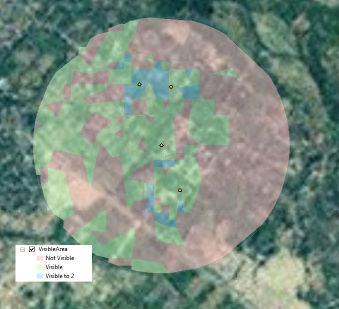

# Analysis tools

## Sections
* [AdjustSampleDataDates](#adjustsampledatadates)
* [Helicopter Landing Zone Tools](#helicopter-landing-zone-tools)
* [Incident Analysis Tools](#incident-analysis-tools)
* [Village Clearing](#village-clearing)
* [Issues](#issues)
* [Contributing](#contributing)
* [Licensing](#licensing)

## AdjustSampleDataDates

Included tools:
* Change Sample Data Dates to Recent Dates

## Helicopter Landing Zone Tools

Included tools:
* Choose Field Value Model
* Choose Field Value Script Tool
* Generate Intermediate Layers
* HLZ Touchdown Points
* MinimumBoundingFishnet
* Optionally Union Feature Classes

Associated files:

## Incident Analysis Tools

Included tools:
* Cluster Analysis
* Count Incidents By LOC
* Find Percent Change
* Hot Spots by Area
* Incident Density
* Incident Hot Spots
* Incident Table To Point
* Source Scripts\Add Unique Row ID
* Source Scripts\sourceCC

## Village Clearing

Included tools:
* Canvas Area GRG
* Hot Spot and Density
* Hot Spots by Area
* Linear Line Of Sight
* Number Features
* Point Target GRG
* Radial Line Of Sight
* Base Scripts\Canvas Area GRG Script
* Base Scripts\Create GRG Script
* Base Scripts\CreateFishnet
* Base Scripts\Number Features Script
* Base Scripts\Point Target GRG Script
* Base Scripts\sourceRLOSscript

## Issues

Find a bug or want to request a new feature?  Please let us know by submitting an issue.

## Contributing

Esri welcomes contributions from anyone and everyone. Please see our [guidelines for contributing](https://github.com/esri/contributing).

## Licensing

Copyright 2014 Esri

Licensed under the Apache License, Version 2.0 (the "License");
you may not use this file except in compliance with the License.
You may obtain a copy of the License at

   [http://www.apache.org/licenses/LICENSE-2.0](http://www.apache.org/licenses/LICENSE-2.0)

Unless required by applicable law or agreed to in writing, software
distributed under the License is distributed on an "AS IS" BASIS,
WITHOUT WARRANTIES OR CONDITIONS OF ANY KIND, either express or implied.
See the License for the specific language governing permissions and
limitations under the License.

A copy of the license is available in the repository's
[license.txt](license.txt) file.

