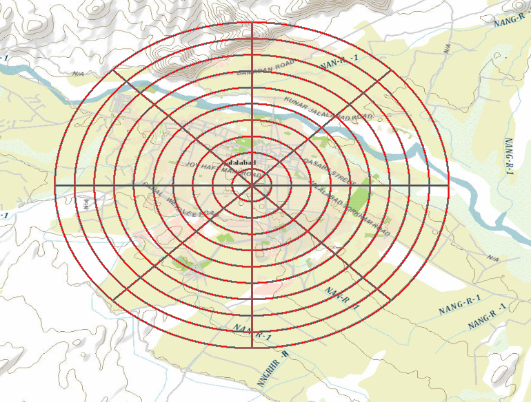

# Common tools

## Sections
* [Military Aspects of Terrain Toolbox](#military-aspects-of-terrain-toolbox)
* [Position Analysis Tools](#position-analysis-tools)
* [Publishable Task Tools](#publishable-task-tools)
* [Range Card Tools](#range-card-tools)
* [Visibility and Range Tools](#visibility-and-range-tools)
* [Issues](#issues)
* [Contributing](#contributing)
* [Licensing](#licensing)

## Military Aspects of Terrain Toolbox
Contains tools used in the Military Aspects Of Terrain template (MAoT). They are tools for doing terrain analysis as part of the Intelligence Preparation of the Battlefield process.

Included tools:
* Generate Intermediate Layers
* Cover and Concealment\Concealment from Aerial Detection
* Cover and Concealment\Cover From Flat Trajectory Weapons
* Observation and Fields of Fire\Find Local Peaks
* Observation and Fields of Fire\Highest Points Near Locations
* Observation and Fields of Fire\Linear Line Of Sight
* Observation and Fields of Fire\Lowest Points Near Locations
* Observation and Fields of Fire\Range Fan From Bearing and Traversal With Visibility
* Suitability Tools\Artillery Slope Tint
* Suitability Tools\Find Unused HLZs
* Suitability Tools\FM 5-33 CCM
* Suitability Tools\Raster Off-road mobility
* Suitability Tools\Suitable Drop Zones
* Suitability Tools\Suitable HLZs

Associated files:
* [toolboxes\scripts\Concealment.py](./toolboxes/scripts/Concealment.py)
* [toolboxes\layers\Concealment.lyr](./toolboxes/layers/Concealment.lyr)
* [toolboxes\layers\Cover from Flat Trajectory Weapons.lyr](./toolboxes/layers/Cover from Flat Trajectory Weapons.lyr)
* [toolboxes\layers\Highest Point Output.lyr](./toolboxes/layers/Highest Point Output.lyr)
* [toolboxes\layers\Linear Line of Sight Output.lyr](./toolboxes/layers/Linear Line of Sight Output.lyr)
* [toolboxes\layers\Lowest Point Output.lyr](./toolboxes/layers/Lowest Point Output.lyr)
* [toolboxes\layers\Radial Line Of Sight Output.lyr](./toolboxes/layers/Radial Line Of Sight Output.lyr)
* [toolboxes\layers\Output Artillery Tint.lyr](./toolboxes/layers/Output Artillery Tint.lyr)
* [toolboxes\scripts\FM5-33CCM.py](./toolboxes/scripts/FM5-33CCM.py)
* [toolboxes\scripts\RasterOffRoad.py](./toolboxes/scripts/RasterOffRoad.py)
* [toolboxes\layers\RasterOffRoadOutput.lyr](./toolboxes/layers/RasterOffRoadOutput.lyr)
* [toolboxes\layers\Drop Zones.lyr](./toolboxes/layers/Drop Zones.lyr)
* [toolboxes\scripts\RangeFan.py](./toolboxes/scripts/RangeFan.py)
* [toolboxes\scripts\zfactor.py](./toolboxes/scripts/zfactor.py)
* [toolboxes\scripts\GenerateIntermediateLayers.py](./toolboxes/scripts/GenerateIntermediateLayers.py)

## Position Analysis Tools

Included tools:
* Convert Coordinates
* Locate Event
* Range Rings
* Table To 2-Point Line
* Table To Ellipse
* Table To Line Of Bearing
* Table To Point
* Table To Polygon
* Table To Polyline

Associated files:
* [toolboxes\layers\ObservationLines.lyr](./toolboxes/layers/ObservationLines.lyr)
* [toolboxes\layers\EstimateArea.lyr](./toolboxes/layers/EstimateArea.lyr)
* [toolboxes\scripts\ConvertCoordinates.py](./toolboxes/scripts/ConvertCoordinates.py)
* [toolboxes\scripts\RangeRings2.py](./toolboxes/scripts/RangeRings2.py)
* [toolboxes\layers\RangeRings.lyr](./toolboxes/layers/RangeRings.lyr)
* [toolboxes\layers\RangeRadials.lyr](./toolboxes/layers/RangeRadials.lyr)
* [toolboxes\layers\TableTo2PointLine.lyr](./toolboxes/layers/TableTo2PointLine.lyr)
* [toolboxes\layers\TableToEllipse.lyr](./toolboxes/layers/TableToEllipse.lyr)
* [toolboxes\layers\TableToLineOfBearing.lyr](./toolboxes/layers/TableToLineOfBearing.lyr)
* [toolboxes\layers\TableToPoint.lyr](./toolboxes/layers/TableToPoint.lyr)
* [toolboxes\layers\TableToPolygon.lyr](./toolboxes/layers/TableToPolygon.lyr)
* [toolboxes\layers\TableToPolyline.lyr](./toolboxes/layers/TableToPolyline.lyr)

## Publishable Task Tools

Included tools:
* Fast Visibility\Fast Visibility By Circle
* Fast Visibility\Fast Visibility By Distance
* Fast Visibility\Fast Visibility By Line
* Fast Visibility\Fast Visibility By Parameters
* Road Network\Drive Time
* Road Network\Point-to-Point Route

Associated files:
* [toolboxes\layers\RLOS As Raster.lyr](./toolboxes/layers/RLOS As Raster.lyr)
* [toolboxes\layers\drivetimes.lyr](./toolboxes/layers/drivetimes.lyr)
* [toolboxes\layers\Routes.lyr](./toolboxes/layers/Routes.lyr)
* [toolboxes\layers\Polygon Barriers.lyr](./toolboxes/layers/Polygon Barriers.lyr)
* [toolboxes\layers\Point Barriers.lyr](./toolboxes/layers/Point Barriers.lyr)
* [toolboxes\layers\Stops.lyr](./toolboxes/layers/Stops.lyr)
* [toolboxes\layers\Line Barriers.lyr](./toolboxes/layers/Line Barriers.lyr)

## Range Card Tools

Included tools:
* Create Range Fan Index Features
* Merge (System Tool)
* Range Fans From Bearing And Traversal
* Range Fans From Bearing Limits

Associated files:
* [toolboxes\scripts\CreateRangeFanBoxes.py](./toolboxes/scripts/CreateRangeFanBoxes.py)
* [toolboxes\layers\Range Fan Index Features.lyr](./toolboxes/layers/Range Fan Index Features.lyr)
* [toolboxes\layers\Range Fan Weapon Locations.lyr](./toolboxes/layers/Range Fan Weapon Locations.lyr)
* [toolboxes\scripts\RangeFanByBearingAndTraversal.py](./toolboxes/scripts/RangeFanByBearingAndTraversal.py)
* [toolboxes\layers\Range Fan Output.lyr](./toolboxes/layers/Range Fan Output.lyr)
* [toolboxes\scripts\RangeFanByBearingLimits.py](./toolboxes/scripts/RangeFanByBearingLimits.py)

## Visibility and Range Tools
Visibility and Range Tools allow you to: 
* Create range rings with radials around points at specified intervals and distances 
* Create range fans interactively, or from features with attributes for range, bearing, and traversal 
* Find highest and lowest points 
* Create lines of sight between observers and targets 
* Find the areas visible and invisible to one or more observer points

Included tools:
* Attach Profile Graph To LLOS
* Find Local Peaks
* Highest Point
* Linear Line Of Sight
* Lowest Point
* Radial Line Of Sight
* Range Fan
* Range Fans By Feature:
* Range Rings
* Trajectory
* Visibility Toolset\Fast Visibility By Circle
* Visibility Toolset\Fast Visibility By Distance
* Visibility Toolset\Fast Visibility By Line
* Visibility Toolset\Fast Visibility By Parameters

Associated files:
* [toolboxes\scripts\RangeFan.py](./toolboxes/scripts/RangeFan.py)
* [toolboxes\layers\Range Fan Output.lyr](./toolboxes/layers/Range Fan Output.lyr)
* [toolboxes\scripts\RangeFansByFeature.py](./toolboxes/scripts/RangeFansByFeature.py)
* [toolboxes\scripts\RLOS.py](./toolboxes/scripts/RLOS.py)
* [toolboxes\scripts\RangeRings2.py](./toolboxes/scripts/RangeRings2.py)
* [toolboxes\layers\RangeRadials.lyr](./toolboxes/layers/RangeRadials.lyr)
* [toolboxes\layers\RangeRings.lyr](./toolboxes/layers/RangeRings.lyr)
* [toolboxes\scripts\zfactor.py](./toolboxes/scripts/zfactor.py)
* [toolboxes\scripts\LLOSProfileGraphAttachments.py](./toolboxes/scripts/LLOSProfileGraphAttachments.py)
* [toolboxes\scripts\Trajectory_Path.py](./toolboxes/scripts/Trajectory_Path.py)
* [toolboxes\layers\RLOS As Raster.lyr](./toolboxes/layers/RLOS As Raster.lyr)
* [toolboxes\layers\Highest Point Output.lyr](./toolboxes/layers/Highest Point Output.lyr)
* [toolboxes\layers\Linear Line of Sight Output.lyr](./toolboxes/layers/Linear Line of Sight Output.lyr)
* [toolboxes\layers\Lowest Point Output.lyr](./toolboxes/layers/Lowest Point Output.lyr)
* [toolboxes\layers\Radial Line Of Sight Output.lyr](./toolboxes/layers/Radial Line Of Sight Output.lyr)

## Issues

Find a bug or want to request a new feature?  Please let us know by submitting an issue.

## Contributing

Esri welcomes contributions from anyone and everyone. Please see our [guidelines for contributing](https://github.com/esri/contributing).

## Licensing

Copyright 2014 Esri

Licensed under the Apache License, Version 2.0 (the "License");
you may not use this file except in compliance with the License.
You may obtain a copy of the License at

   [http://www.apache.org/licenses/LICENSE-2.0](http://www.apache.org/licenses/LICENSE-2.0)

Unless required by applicable law or agreed to in writing, software
distributed under the License is distributed on an "AS IS" BASIS,
WITHOUT WARRANTIES OR CONDITIONS OF ANY KIND, either express or implied.
See the License for the specific language governing permissions and
limitations under the License.

A copy of the license is available in the repository's
[license.txt](license.txt) file.

