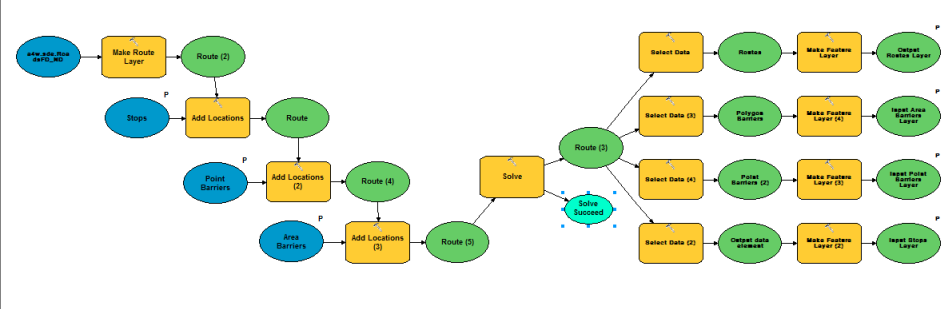

# Data Management Tools

Data Management tools help to prepare, format, filter, and organize your data into usable formats.

## Sections

* [Relationship to mdcs-py](#relationship-to-mdcs-py)
* [Adjust Sample Data Dates Tools](#adjust-sample-data-dates-tools)
* [CADRG ECRG Tools](#cadrg-ecrg-tools)
* [CIB Tools](#cib-tools)
* [Elevation Tools](#elevation-tools)
* [Geonames Tools](#geonames-tools)
* [Import and Conversion Tools](#import-and-conversion-tools)
* [LiDAR Elevation Tools](#lidar-elevation-tools)
* [Network Data Preparation Tools](#network-data-preparation-tools)
* [Patrol Data Capture Tools](#patrol-data-capture-tools)
* [Publishable Task Tools](#publishable-task-tools)
* [Issues](#issues)
* [Licensing](#licensing)

## Relationship to mdcs-py
Mosaic Dataset Configuration Scripts (MDCS) is a set of tools used to create and manage mosaic datasets in ArcGIS. A few of the Data Management toolboxes in this repository require the MDCS tools to run:

* CADRG ECRG Tools.pyt
* CIB Tools.pyt
* Elevation Tool.pyt

MDCS is maintained as a separate repository from Solutions Geoprocessing Toolbox ([mdcs-py](https://github.com/Esri/mdcs-py)). But for convenience the mdcs-py repository has been copied to a subfolder named **mdcs**.

## Adjust Sample Data Dates Tools

This toolbox contains a tool to adjust the date fields of the sample data included with the Incident Analysis toolbox.
Supports the [Incident Analysis](http://solutions.arcgis.com/defense/templates/incident-analysis/) template.

* Change Sample Data Dates to Recent Dates

These tools are a part of the [Incident Analysis Template](http://www.arcgis.com/home/item.html?id=384d223647b24bcf9d2c6fd44f90d17f)

## CADRG ECRG Tools

> IMPORTANT: This toolbox is moving to Mature Support and will be removed in the future, but will be available from earlier [releases](https://github.com/Esri/solutions-geoprocessing-toolbox/releases).

This toolbox will help to automate the creation of CADRG/ECRG Mosaic Datasets. 

* CADRG/ECRG Mosaic Datasets

## CIB Tools

> IMPORTANT: This toolbox is moving to Mature Support and will be removed in the future, but will be available from earlier [releases](https://github.com/Esri/solutions-geoprocessing-toolbox/releases).

* Create CIB Mosaic

## Elevation Tools

> IMPORTANT: This toolbox is moving to Mature Support and will be removed in the future, but will be available from earlier [releases](https://github.com/Esri/solutions-geoprocessing-toolbox/releases).

* Create Derived Elevation Mosaic
* Create Source Elevation Mosaic

## Geonames Tools

Tools for building geonames locator.
Supports the [Geonames Locator](http://solutions.arcgis.com/defense/templates/geonames-locator/) template.

* Create Geonames Gazetter Locator
* Load Geonames File

## Import and Conversion Tools (formerly Position Analysis Tools)

> IMPORTANT: This toolbox is moving to Mature Support and will be removed in the future, but will be available from earlier [releases](https://github.com/Esri/solutions-geoprocessing-toolbox/releases).

Tools for converting tabular information to different geometries, and generating coordinate location datasets.

* Convert Coordinates
* Locate Event
* Table To 2-Point Line
* Table To Ellipse
* Table To Line Of Bearing
* Table To Point
* Table To Polygon
* Table To Polyline

These tools are a part of the [Import and Conversion Tools](http://solutions.arcgis.com/intelligence/templates/import-conversion/) template.

** - Range Rings has been removed from Import and Conversion as it is a duplication of the same tool in Visibility and Range Tools.

## LiDAR Elevation Tools

This toolbox contains tools that  create surface or terrain mosaics from LiDAR data.

* Create Source LAS Ground Elevation Mosaic
* Create Source LAS Surface Elevation Mosaic

## Network Data Preparation Tools

> IMPORTANT: This toolbox is moving to Mature Support and will be removed in the future, but will be available from earlier [releases](https://github.com/Esri/solutions-geoprocessing-toolbox/releases).

These tools are used to prepare road data for use in a road network dataset.

* Add Orientation Angle To Lines
* Add Travel Time To Roads
* Feature Class to Feature Class (System Tool)
* Split Lines At Intersections

## Patrol Data Capture Tools

> IMPORTANT: This toolbox is moving to Mature Support and will be removed in the future, but will be available from earlier [releases](https://github.com/Esri/solutions-geoprocessing-toolbox/releases).

Includes tools to import data that has been gathered on or after a patrol. This includes GPS data, saved in .gpx files, and Patrol Report data, saved in .xml files (as saved by an Infopath form)

* Append Tracks to DB
* Despike GPS Log
* Distinguish Tracks
* GPX to Layer
* Import Patrol Rpt
* Make Track Lines
* Recalculate Delta Times
* Rejoin Track Parts
* Remove Duplicate GPS Data

These tools are a part of the [Patrol Data Capture](http://www.arcgis.com/home/item.html?id=6238c4cdb3ca4a7ea54287241f53349f) template.

## Publishable Task Tools

> IMPORTANT: This toolbox is moving to Mature Support and will be removed in the future, but will be available from earlier [releases](https://github.com/Esri/solutions-geoprocessing-toolbox/releases).

Publishable Tasks are a series of models that should be published as geoprocessing services for:

* Fast Visibility: visibility tools optimized to be run as geoprocessing services
  * Fast Visibility By Circle
  * Fast Visibility By Distance
  * Fast Visibility By Line
  * Fast Visibility By Parameters

* Road Network: tools for routing and drive time
  * Drive Time
  * Point-to-Point Route

## Issues

Find a bug or want to request a new feature?  Please let us know by submitting an [Issue](https://github.com/Esri/solutions-geoprocessing-toolbox/issues).

## Licensing

Copyright 2015 Esri

Licensed under the Apache License, Version 2.0 (the "License");
you may not use this file except in compliance with the License.
You may obtain a copy of the License at

   [http://www.apache.org/licenses/LICENSE-2.0](http://www.apache.org/licenses/LICENSE-2.0)

Unless required by applicable law or agreed to in writing, software
distributed under the License is distributed on an "AS IS" BASIS,
WITHOUT WARRANTIES OR CONDITIONS OF ANY KIND, either express or implied.
See the License for the specific language governing permissions and
limitations under the License.

A copy of the license is available in the repository's
[license.txt](license.txt) file.

