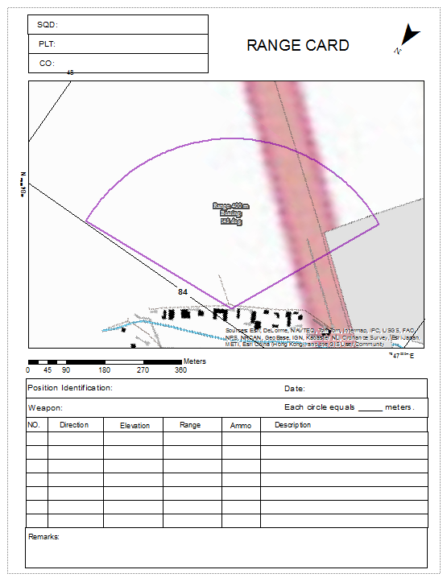

# Operational Graphics Tools

Create and visualize graphic products in support of operations.

;

## Sections

* [Clearing Operations Tools](#clearing-operations-tools)
* [Range Card Tools](#range-card-tools)
* [Issues](#issues)
* [Licensing](#licensing)

## Clearing Operations Tools

Tools for building gridded reference graphics (GRG) for marking buildings and structures for clearing operations.
Supports the [Clearing Operations](http://solutions.arcgis.com/defense/templates/clearing-operations/) template.

* Canvas Area GRG
* Linear Line Of Sight
* Number Features
* Point Target GRG
* Radial Line Of Sight

These tools are part of the [Clearing Operations](http://www.arcgis.com/home/item.html?id=b84edd236d4c48aba3f8406dd94ff13b) template.

## Range Card Tools

> IMPORTANT: This toolbox is moving to Mature Support and will be removed in the future, but will be available from earlier [releases](https://github.com/Esri/solutions-geoprocessing-toolbox/releases).

Tools to build range cards for defensive positions.

* Create Range Fan Index Features
* Data Driven Pages Simulator (DDP-S)
 * NOTE - __The DDP-S script is a temporary workaround until the ArcGIS Pro team implements that functionality in the core software. The orignal source for this tool is [here](http://www.arcgis.com/home/item.html?id=f0ff6eb587b04ac29efb425a86f29fe2)__
* Merge (System Tool)

These tools are part of the [Range Cards](http://www.arcgis.com/home/item.html?id=22b1015a131e48a9ba31bf785272f08e)  Template.

## Issues

Find a bug or want to request a new feature?  Please let us know by submitting an [Issue](https://github.com/Esri/solutions-geoprocessing-toolbox/issues).

## Licensing

Copyright 2014 Esri

Licensed under the Apache License, Version 2.0 (the "License");
you may not use this file except in compliance with the License.
You may obtain a copy of the License at

   [http://www.apache.org/licenses/LICENSE-2.0](http://www.apache.org/licenses/LICENSE-2.0)

Unless required by applicable law or agreed to in writing, software
distributed under the License is distributed on an "AS IS" BASIS,
WITHOUT WARRANTIES OR CONDITIONS OF ANY KIND, either express or implied.
See the License for the specific language governing permissions and
limitations under the License.

A copy of the license is available in the repository's
[license.txt](license.txt) file.

