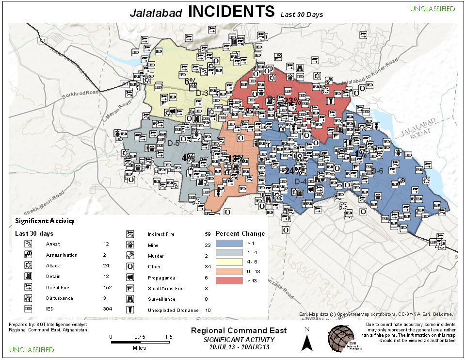

# Patterns Tools

Find patterns and trends through statistical and visual analysis.

;

## Sections

* [Incident Analysis Tools](#incident_analysis_tools)
* [Issues](#issues)
* [Contributing](#contributing)
* [Licensing](#licensing)

## Incident Analysis Tools

These tools help you discover spatial patterns and trends in significant activity in your area of interest.

* Cluster Analysis
* Count Incidents By LOC
* Find Percent Change
* Hot Spots By Area
* Incident Density
* Incident Hot Spots
* Incident Table To Point

## Issues

Find a bug or want to request a new feature?  Please let us know by submitting an issue.

## Contributing

Esri welcomes contributions from anyone and everyone. Please see our [guidelines for contributing](https://github.com/esri/contributing).

## Licensing

Copyright 2014 Esri

Licensed under the Apache License, Version 2.0 (the "License");
you may not use this file except in compliance with the License.
You may obtain a copy of the License at

   [http://www.apache.org/licenses/LICENSE-2.0](http://www.apache.org/licenses/LICENSE-2.0)

Unless required by applicable law or agreed to in writing, software
distributed under the License is distributed on an "AS IS" BASIS,
WITHOUT WARRANTIES OR CONDITIONS OF ANY KIND, either express or implied.
See the License for the specific language governing permissions and
limitations under the License.

A copy of the license is available in the repository's
[license.txt](license.txt) file.

