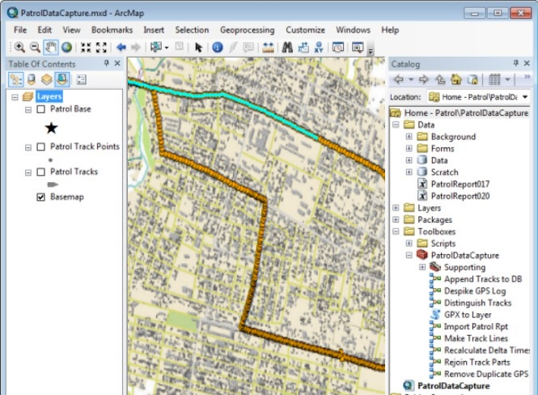

# patrol-data-capture-toolbox

The Patrol Data Capture template demonstrates best practices for importing GPS eXchange Format (GPX/.gpx) files into ArcGIS Desktop. The template also contains specialized tools for analyzing and processing this data. 

## Features

* Specialized geoprocessing models and tools for importing GPX files into ArcGIS Desktop
* Tools for processing and analyzing this data to
    * Tie patrol report information to corresponding patrol tracks
    * View patrol report information in the map for a given track
    * Identify anomalies/spikes and trends/patterns

## Instructions

### General Help
[New to Github? Get started here.](http://htmlpreview.github.com/?https://github.com/Esri/esri.github.com/blob/master/help/esri-getting-to-know-github.html)

### Getting Started with the toolbox
* Install and configure Apache Ant
    * Download Ant from the [Apache Ant Project](http://ant.apache.org/bindownload.cgi) and unzip to a location on your machine
    * Set environment variable `ANT_HOME` to Ant Install Location
    * Add Ant\bin to your path: `%ANT_HOME%\bin`
    * NOTE: Ant requires Java [Runtime Environment (JRE) or Developer Kit (JDK)](http://www.oracle.com/technetwork/java/javase/downloads/index.html) to be installed and the environment variable `JAVA_HOME` to be set to this location
    * To verify your Ant Installation: Open Command Prompt> `ant -v` and verify it runs and returns the version correctly 
    * You may optionally install the [PyDev Eclipse Plugin for Python](http://pydev.org) if you plan to use Eclipse to run/debug
* To download the data dependencies 
    * Open Command Prompt>
    * cd patrol-data-capture-toolbox
    * > ant
    * Verify "Build Succeeded"
    * This script populates the folder: patrol-data-capture-toolbox\data
* To run unit tests
    * Open Command Prompt>
    * > cd patrol-data-capture-toolbox\source\test
    * > ant
    * Verify "Build Succeeded"

## Requirements

* ArcGIS Desktop 10.1 Standard 
* Apache Ant - used to download and extract dependent data and run test drivers
* Java Runtime Environment (JRE) or Developer Kit (JDK)

## Resources

* Learn more about Esri's [ArcGIS for Defense maps and apps](http://resources.arcgis.com/en/communities/defense-and-intelligence/).

## Issues

* Find a bug or want to request a new feature?  Please let us know by submitting an issue.

## Contributing

Esri welcomes contributions from anyone and everyone. Please see our [guidelines for contributing](https://github.com/esri/contributing).

## Licensing

Copyright 2013 Esri

Licensed under the Apache License, Version 2.0 (the "License");
you may not use this file except in compliance with the License.
You may obtain a copy of the License at

   http://www.apache.org/licenses/LICENSE-2.0

Unless required by applicable law or agreed to in writing, software
distributed under the License is distributed on an "AS IS" BASIS,
WITHOUT WARRANTIES OR CONDITIONS OF ANY KIND, either express or implied.
See the License for the specific language governing permissions and
limitations under the License.

A copy of the license is available in the repository's
[license.txt](license.txt) file.

