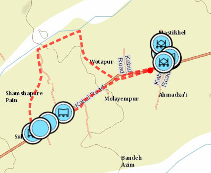

# Planning tools

## Sections

*[Build Elevation Mosaic Tools](#patrol-data-capture)
*[Issues](#issues)
*[Contributing](#contributing)
*[Licensing](#licensing)

## Patrol Data Capture
This toolbox contains the model for processing GPS data into ArcGIS to create patrol tracks on a map. Most GPS navigation devices allow you to export a .gpx file that can be used in ArcGIS. 

These tools help you:
• Importing the .gpx data 
• Removing spikes (removing errors, for example, points the GPS created when connection to satellite was temporarily lost). Also known as de-spiking the data 
• Making sure each track is distinguished from other tracks (has not merged into a previous or subsequent track) 
• Creating the track lines in a layer by appending them to the layer 
• Rejoining tracks

## Issues

Find a bug or want to request a new feature?  Please let us know by submitting an issue.

## Contributing

Esri welcomes contributions from anyone and everyone. Please see our [guidelines for contributing](https://github.com/esri/contributing).

## Licensing

Copyright 2014 Esri

Licensed under the Apache License, Version 2.0 (the "License");
you may not use this file except in compliance with the License.
You may obtain a copy of the License at

   [http://www.apache.org/licenses/LICENSE-2.0](http://www.apache.org/licenses/LICENSE-2.0)

Unless required by applicable law or agreed to in writing, software
distributed under the License is distributed on an "AS IS" BASIS,
WITHOUT WARRANTIES OR CONDITIONS OF ANY KIND, either express or implied.
See the License for the specific language governing permissions and
limitations under the License.

A copy of the license is available in the repository's
[license.txt](license.txt) file.

