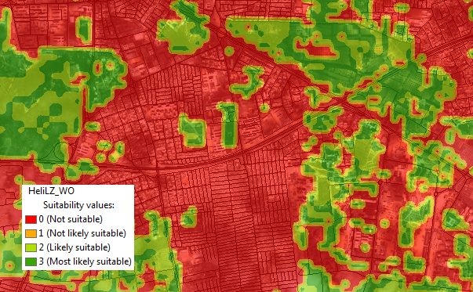

# Suitability Tools

Determine areas most suitable for both friendly and adversarial operations.

## Sections

* [Maritime Decision Aid Tools](#maritime_decision_aid_tools)
* [Military Aspects Of Terrain Tools](#military-aspects-of-terrain-tools)
* [Path Slope Tools](#path-slope-tools)
* [Issues](#issues)
* [Contributing](#contributing)
* [Licensing](#licensing)

## Maritime Decision Aid Tools

Tools included in this toolbox help analysts understand threats against operations in the maritime domain. Some of these geoprocessing tools help analysts understand the capabilities of submarines, such as where submarines can physically operate and areas where they have an advantage (such as in canyons). Other tools are more general in nature and can be used for understanding where a vessel can travel in an amount of time, as well as how far a vessel can see based off of height of the viewer.

* Farthest On Circle
* Find Submarine Canyons
* Sub Depth Restriction Analysis
* Sub Specifications Tool
* Visibility Range at Sea

## Military Aspects Of Terrain Tools

Contains tools used in the Military Aspects Of Terrain (MAoT) template. They are tools for doing terrain analysis as part of the Intelligence Preparation of the Battlefield process.
These tools are part of the Military Aspects of Terrain template: http://www.arcgis.com/home/item.html?id=e3efcbb9fb9f442caeb9968bdf9b8f37

* Cover and Concealment
  * Concealment from Aerial Detection
  * Cover From Flat Trajectory Weapons
* Observations and Fields of Fire
  * Find Local Peaks
  * Highest Points Near Locations
  * Linear Line Of Sight
  * Lowest Points Near Locations
  * Range Fan From Bearing and Traversal With Visibility
* Suitability Tools
  * Artillery Slope Tint
  * Find Unused HLZs
  * FM 5-33 CCM
  * Raster Off-road Mobility
  * Suitable Drop Zones
  * Suitable HLZs
* Generate Intermedate Layers

## Path Slope Tools

Path Slope Tools is a terrain analysis toolset to determine slope changes along linear features (paths). For example finding percent slope along roadways or degree slope along trails.These can then be used to determine vehicle crossing limits or areas dangerous to hikers.

* Path Slope
* Path Slope By Custom Table
* Path Slope By Reclass Values

## Issues

Find a bug or want to request a new feature?  Please let us know by submitting an issue.

## Contributing

Esri welcomes contributions from anyone and everyone. Please see our [guidelines for contributing](https://github.com/esri/contributing).

## Licensing

Copyright 2014 Esri

Licensed under the Apache License, Version 2.0 (the "License");
you may not use this file except in compliance with the License.
You may obtain a copy of the License at

   [http://www.apache.org/licenses/LICENSE-2.0](http://www.apache.org/licenses/LICENSE-2.0)

Unless required by applicable law or agreed to in writing, software
distributed under the License is distributed on an "AS IS" BASIS,
WITHOUT WARRANTIES OR CONDITIONS OF ANY KIND, either express or implied.
See the License for the specific language governing permissions and
limitations under the License.

A copy of the license is available in the repository's
[license.txt](license.txt) file.

