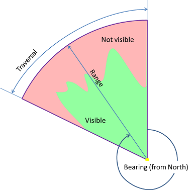

# Visibility Tools

Tools to determine what you can or cannot see from a location.

## Sections

* [Sun Position Analysis Tools](#sun_position_analysis_tools)
* [Visibility and Range Tools](#visibility_and_range_tools)
* [Visibility Data Prep Tools](#visibility_data_prep_tools)
* [Issues](#issues)
* [Contributing](#contributing)
* [Licensing](#licensing)

## Sun Position Analysis Tools

Analyze sun position and hillshade based on a date and time.

* Sun Position and Hillshade

## Visibility and Range Tools

Tools to help basic visibility and distance analysis from locations.

* Visibility Services
  * Fast Visibility By Circle
  * Fast Visibility By Distance
  * Fast Visibility By Line
  * Fast Visibility By Parameters
  * Visibility By Spherical Horizon
* Attach Profile Graph To LLOS
* Find Local Peaks
* Highest Points
* Linear Line Of Sight
* Lowest Points
* Radial Line Of Sight
* Radial Line Of Sight - Multiple Positions
* Radial Line Of Sight - Single Position
* Radial Line of Sight and Range
* Range Fan
* Range Fans From Weapon Bearing Limits
* Range Fans From Weapon Parameters
* Range Rings
* Trajectory

## Visibility Data Prep Tools

Tools use to update position data for Visibility and Range Template.

* Update Defensive Position Domain

## Issues

Find a bug or want to request a new feature?  Please let us know by submitting an issue.

## Contributing

Esri welcomes contributions from anyone and everyone. Please see our [guidelines for contributing](https://github.com/esri/contributing).

## Licensing

Copyright 2014 Esri

Licensed under the Apache License, Version 2.0 (the "License");
you may not use this file except in compliance with the License.
You may obtain a copy of the License at

   [http://www.apache.org/licenses/LICENSE-2.0](http://www.apache.org/licenses/LICENSE-2.0)

Unless required by applicable law or agreed to in writing, software
distributed under the License is distributed on an "AS IS" BASIS,
WITHOUT WARRANTIES OR CONDITIONS OF ANY KIND, either express or implied.
See the License for the specific language governing permissions and
limitations under the License.

A copy of the license is available in the repository's
[license.txt](license.txt) file.

